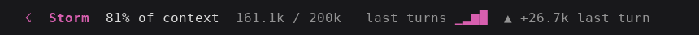
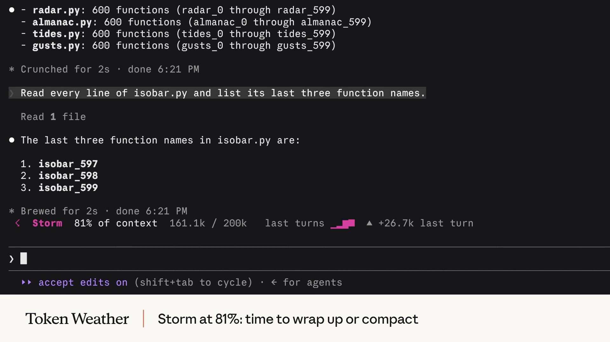

# ☂ Token Showers

**A weather forecast for your Claude Code context window, live in the band above the prompt.**



This is a working implementation of **Token Weather**, the mod shown in Anthropic's
[Getting started with Claude Code mods](https://claude.dev/blog/getting-started-with-claude-code-mods/).
It looks and behaves like the one in the post: install it and the forecast shows up in your terminal.

[](https://claude.dev/media/eccd73c962a5b22578cf5bfd4fa214f6ecd9e602a1cb8df519db737b99932f05.mp4)

<sub>▶ <a href="https://claude.dev/media/eccd73c962a5b22578cf5bfd4fa214f6ecd9e602a1cb8df519db737b99932f05.mp4">Watch the demo video</a>, or click the image above (from the claude.dev blog).</sub>

## Install

Inside Claude Code:

```
/plugin marketplace add hamza-siddiq/token-showers
/plugin install token-weather@token-showers
```

That's it. The band appears after your next turn, and in every session after that.

## Turn it on and off

`/token-weather` is a switch: type it bare to flip the band off or back on.

| Command | Does |
| --- | --- |
| `/token-weather` | flips it: on → off, off → on |
| `/token-weather on` / `off` | sets it |
| `/token-weather status` | says which |

It runs right away, even while Claude is mid-turn, and your choice is remembered: a session
started with it off stays off until you turn it back on. Readings keep coming in while it's off,
so the chart is whole when it comes back, and switching it on mid-session shows the band at once.

## The forecast

| Context used | Forecast |
| --- | --- |
| under 25% | ☀ **Clear** |
| 25–50% | ☁ **Cloudy** |
| 50–75% | ☂ **Showers** |
| 75–90% | ☇ **Storm** |
| 90%+ | ↯ **Compact soon** |

Each reading shows:

- **the forecast**, coloured to match (yellow, cyan, blue, magenta, red)
- **the percent of context used**, e.g. `67% of context`
- **the tokens used out of the window**, e.g. `134.4k / 200k`
- on wide terminals (60+ columns), **a sparkline of your last 12 turns** and the change since the last one (`▲ +12.3k last turn`, `▼ 120k last turn` after a compaction, or `steady`)

You can see the next `/compact` coming before it happens.

## How it works

It's a small [Claude Code mod](https://claude.dev/blog/getting-started-with-claude-code-mods/): one `ui.render` hook draws the
`AbovePrompt` band, and one reading per turn is kept in `$.state`. `session.start` registers the
`/token-weather` command; the switch is kept in the mod's own `$.store`, so it survives between sessions.

```
token-weather/
├── .claude-plugin/plugin.json
├── hooks/
│   ├── hooks.json
│   ├── register.tsx   # the band and /token-weather
│   └── forecast.ts    # weather, token formatting, sparkline, trend, the switch
├── tests/token-weather.test.ts
└── types/index.d.ts   # the $.state contract (readings, the switch)
```

## Try it without installing

```sh
git clone https://github.com/hamza-siddiq/token-showers
claude --plugin-dir token-showers/token-weather
```

## Develop

```sh
claude plugin validate token-weather
claude plugin test token-weather
```

PRs welcome: new weather, other surfaces, better thresholds.

---

Inspired by the Token Weather example from the claude.dev blog. Images and the demo video are from that post.
